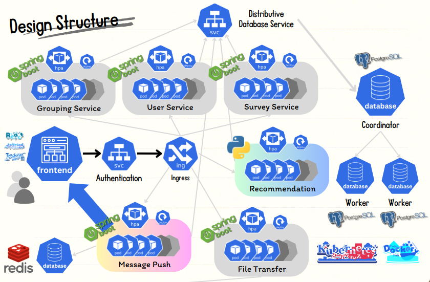

# GroupUp_NUS_SWs_Project
Github Repository: [https://github.com/FrostyHec/GroupUp_NUS_SWs_Project](https://github.com/FrostyHec/GroupUp_NUS_SWs_Project)

Team Member:
- Student 1: Zhengdong Huang, t0933325, Backend Design and Cloud Service Design
- Student 2: Hemu Liu, t0933548, Backend Design and Cloud Service Design
- Student 3: Zihang Wu, t0933464, Frontend Design
- Student 4: Yicheng Xiao, t0933333, Frontend Design and Poster Design

## 1. Project Overview
### 1.1 Project Description

When our class begins, we are required to find our teammates. It is not uncommon that we tend to naturally group up with someone from the same universities because of familiarity. However, by grouping up like this, we cannot even get to know each other pretty well. Then this idea comes across us: We can design a cloud-based grouping application for this scenario! We aim to design a system where you can find your teammates based on recommendation!

### 1.2 System Architecture

The structure of our process can be describe as follows. 



### 1.3 Key Components
- **Frontend Service**: 
 - Main Page:
  - Dashboard: You can checkout all the surveys you created and participated in.
  - Inbox: You can receive announcements, requests and request response here. 
 - Owner Page:
  - Dashboard: You can check out some basic information of the survey including member counts, group counts, form-fulfilled members counts and grouped member counts. Also, an announcement board is presented here and you can send announcement to all members. 
  - Form: You can create questionnaire in this field. TextField, TextAreaField, DateField, NumberField, SelectField and CheckboxGroupsField are supported. 
  - Info: You can define the fields that will be demonstrated on the member personal information card. 
  - Member: You can invite members to the surveys and you can see the Info page and the questionnaire every member filled in.
  - Groups: You can check out the grouping status.
 - User Page:
  - Dashboard: You can check out some basic information of the survey including member counts, group counts, form-fulfilled members counts and grouped member counts. Also, you can checkout the announcements.
  - Form: You can fill in the questionnaire here! Please fill in the questionnaire first and then go to recommendation for matching.
  - Info: You can fill in the fields that will be demonstrated on your personal information card.
  - Recommendation: You can get your recommendation from the system based on your survey and your willing. The system will recommend based on semantic meaning. Then you can send request to individual to request to join their groups.
  - Groups: You can check out the grouping status.
- **Recommendation System**: 
 - Recommendation system is designed based on tokenizer and embeddings. We first will transform a questionnaire answer to a embedding vector. Each member will have several vectors with the same dimension according to the question numbers. Then the system will calculate the semantic similarity between each embeddings and return a value from 0 to 100. This can help member find someone he/she is interested in. 
 - Also, we design a matching feature for owner to use. As the owner can pre-match all the members based on their questionnaire if no one is trying to reach out to each other. The pre-matching algorithm is based on the recommended values get from above and then execute generalized stable matching algorithm (Gale-Shapley Algorithm). The remaining users will be grouped according to KNN. 

- **Cloud Service**
 - Ingress service allocating traffic to deployments responsible for different services by Path-based routing and Load Balancing.
 - HPA Deployment of back-end service, enable automation of different service pods to proceed scaling smoothly based on load
 - Citus Distributed Database Service. Multiple pods work together in a distributed manner to support high-speed query of data. Using initial-Container to set worker nodes for coordinator and create database tables at the first time. 
 - RabbitMQ. Deploy mirror message queue services on multiple nodes according to the Pod Anti Affinity policy so that back-end services from any node can quickly obtain messages.
 - Redis, implementing public cache storage between multiple pods, improves the efficiency of commonly used data acquisition, and solves the problem of slow storage acquisition from cloud services.
 - Kube-prometheus, implementing dynamic monitoring of cluster resources, provides a beautiful and customized dashboard interface for operation and maintenance personnel to understand the status of service nodes in real time, and customizes an alert mechanism to facilitate operation and maintenance personnel to respond quickly to special situations.

## 2. Environment Setup
### 2.1 Prerequisites
- **Frontend Service**: 
	```shell
	# Core Software Version
	npm                      10.7.0
	pnpm                     9.4.0
	next                     13.5.6
	axios                    1.7.2
	swr                      2.2.5
	dnd-kit/core             6.1.0
	@types/node              ^20
	@types/react             ^18
	@types/react-dom         ^18
	autoprefixer             ^10
	eslint                   ^8
	eslint-config-next       13.5.6
	postcss                  ^8
	tailwindcss              ^3
	typescript               ^5

	```
	- **Recommendation System**: 
	```python
	# Core Package Version
	openai                    1.35.14
	text2vec                  1.2.9
	scikit-learn              1.5.1
	```

### 2.2 Installation
1. **Frontend Docker Image Build**:
	```bash
	docker system prune -a # Clear the Cache.
	
	# Based on the IP address of the Ingress Service, modify the DockerFile of the frontend application:
	NEXT_PUBLIC_API_URL= # The backend service API URL.
    	NEXT_PUBLIC_API_URL_REC= # The backend recommendation service API URL.
    	NEXT_PUBLIC_MESSAGE_PUSH_API_URL= # The SSE message push service API URL.
    	
    	docker login # Check whether you are logged in.
    	docker build -t ${Username}/frontend:v1.0 . # Create Image based on the DockerFile.
    	docker run -p 3000:3000 ${Username}/frontend:v1.0 # Test it out if you have a backend environment.
    	docker push ${Username}/frontend:v1.0 
    	
    	# Go to Docker Hub and set the repository to public.
	```
2. **Kubernetes Service**:
 - **Kubectl**: 1.30.2 https://kubernetes.io/zh-cn/docs/tasks/tools/
 - **helm**: https://helm.sh/docs/intro/install/
## 3. Application Deployment
1. **Create Namespace**: 
	```bash
	kubectl create ns citus # used to deploy citus distributed database
	kubectl create ns redis # used to deploy redis
	kubectl create ns rabbit # used to deploy rabbit
	kubectl create ns monitoring # used to deploy kube-promethues
	```
2. **Secret Deployment**: 
	```bash
	kubectl apply -f secret.yaml	
	```
3. **StorageClass Deployment**: 
	```bash
	kubectl storage.yaml
	```
4. **Citus Database Service Deployment**: 
	```bash
	kubectl apply -f citus.yaml -n citus
	```
5. **RabbitMQ Deployment**: 
	```bash
	kubectl apply -f rabbitmq.yaml -n rabbit
	```
6. **Redis Deployment**: 
	```bash
	helm repo add https://charts.bitnami.com/bitnami #add bitnami repo
	helm repo update
	helm search repo redis
	helm pull bitnami/redis #pull right version of redis
	#edit values.yaml: 
		#storageClass: "ebs-sc" 
		#password: yourpassword
	helm install redis ./ -n redis
	kubectl get all -n redis #check pods status
	```
7. **Back-end Server Deployment**: 
	```bash
	kubectl apply -f user.yaml #user server and service deployment
	kubectl apply -f survey.yaml #survey server and service deployment
	kubectl apply -f msg.yaml #msg server and service deployment
	```
8.  **Ingress Deployment**: 
	```bash
	helm repo add http://kubernetes.github.io/ingress-nginx
	helm repo update
	helm search repo ingress-nginx
	helm pull ingress-nginx/ingress-nginx
	helm install ingress-nginx ./
	kubectl get pods #check status
	kubectl apply -f ingress.yaml
	```

9. **Kube-prometheus Deployment**: 
	```bash
	git clone https://github.com/prometheus-operator/kube-prometheus.git
	kubectl apply -f ./manifests/setup -n monitoring
	kubectl apply -f ./manifests -n monitoring
	kubectl get pods -n monitoring # check pods status 
	```
10. **Front-end Deployment**: 
	```bash
	kubectl apply -f frontend.yaml
	```
11. **Visit our GroupUp website!**: 
	```bash
	kubectl get svc
	# copy the ExternalIP of front-end-svc and visit in browser
	```
